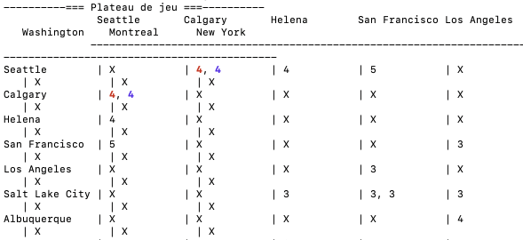

# TP11 - Projet C++ (Jeu de train + architecture de code)

## 🧩 Contexte du projet
Ce projet est un travail pratique (TP11) pour apprendre la conception orientée objet en C++.
Il comprend :
- un moteur de jeu simplifié inspiré de "Ticket to Ride",
- des entités métier (`Plateau`, `Ville`, `VoieFerree`, `Pioche`, `Joueur`),
- des fichiers de données (`map.csv`, `ticket.csv`),
- et une suite de tests unitaires (Google Test).

## 🎯 Objectifs pédagogiques
- modéliser un domaine avec classes et relations,
- lire/charger un plateau depuis un fichier CSV,
- implémenter une boucle de jeu et les règles du tour,
- écrire des tests unitaires pour valider le comportement des composants.

## 🧩 Description du jeu
Le jeu implémente une version simplifiée de "Ticket to Ride" :
- Plateaux de villes et voies ferroviaires via `map.csv`
- Pioche de cartes wagon et de tickets
- Joueurs avec couleur, wagons, tickets réussis
- Tour par tour avec 3 actions : piocher, poser un wagon, ou passer (défausser)

## 📁 Structure du projet
- `include/` : en-têtes (`.h` / `.hpp`)
- `src/` : implémentations (`.cpp`)
- `tests/` : tests unitaires (Google Test)
- `CMakeLists.txt` : configuration CMake
- `map.csv`, `ticket.csv` : données de plateau et tickets

## ▶️ Fonctionnement général
1. `main` crée un objet `Jeu` et lance `partie()`.
2. Le constructeur `Jeu(nbJoueur)` :
   - charge `Plateau` depuis `map.csv`
   - initialise deux pioches (`tickets` et `train`)
   - demande la couleur de chaque joueur
3. `Jeu::partie()` tourne tant que `estFinie()` est faux.
   - chaque tour, chaque joueur choisit 0=piocher, 1=poser un wagon, 2=passer.
4. `Jeu::estFinie()` retourne vrai si un joueur :
   - finit ses wagons, ou
   - a 6 tickets réussis.

## 🛠️ Comment compiler et exécuter
Pré-requis : CMake, compilateur C++17 (g++, clang++, MSVC, mingw64). 

```bash
mkdir -p build
cd build
cmake ..
cmake --build .
```
### Problème lors de la compilation
#### Compilation avec mingw64 de Google Test error : 'mutex' in namespace 'std' does not name a type
Réinstaller mingw64 depuis cette page : https://www.msys2.org/

Puis exécuter le binaire `main` :

- Linux/Mac : `./main`
- Windows : `main.exe`

### Précautions
#### Couleur du texte
Le projet utilise des codes ANSI pour colorer le texte dans la console.
- Si votre terminal ne supporte pas les couleurs ANSI, vous verrez des séquences de caractères comme `\033[31m` au lieu de texte coloré.
- Sur Windows, assurez-vous d'utiliser un terminal compatible ANSI (comme Windows Terminal ou Git Bash) pour voir les couleurs correctement.
- Sur Terminal.app (Mac), si les couleurs ne s'affichent pas, essayez d'activer "Afficher les couleurs ANSI" dans les préférences du terminal.

#### Charger les fichiers de données
Les chemins sont éditable dans `include/config.h`
```
MAP_FILE_PATH = "../map.csv";
TICKET_FILE_PATH = "../ticket.csv";
```

Message d'erreur si le fichier `map.csv` n'est pas trouvé :
```test
Erreur de chargement du fichier carte : ../map.csv
Plateau non chargé
```
Message d'erreur si le fichier `ticket.csv` n'est pas trouvé :
```text
fichier contenant les tickets non ouvert
Nom du fichier : ../ticket.csv
```

#### Wrap lines lors de l'affichage du Plateau
L'affichage du plateau peut être difficile à lire si les lignes sont trop longues, car il contient beaucoup de colonnes.
Si le terminal ne gère pas bien les longues lignes, vous pouvez redimensionner la fenêtre du terminal pour éviter les retours à la ligne automatiques, ou utiliser un terminal qui gère mieux les longues lignes (comme Windows Terminal ou iTerm2 sur Mac).



## 🧪 Lancer les tests unitaires
Depuis `build` :

```bash
ctest --output-on-failure
```

## Génération du diagramme de classes
### Installation de hpp2plantuml
```bash
python3 -m venv venv
source venv/bin/activate  # Linux/Mac
venv\Scripts\activate  # Windows
pip install hpp2plantuml
```
### Génération du diagramme
```bash
hpp2plantuml -i "include/*.h" -o diagramme_classes.puml
```

Ou exécuter chaque cible :
- `VilleTest.out`
- `VoieFerreeTest.out`
- `PiocheTest.out`
- `JoueurTest.out`
- `CarteTest.out`
- `PlateauTest.out`

